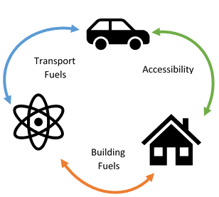

# History and Motivation
This subcommittee ADB40(2) originated as the Integrated Land Use Transport Modeling (ILUTM) subcommittee, chaired first by Prof. Eric Miller (from 2000 to 2009) and then by Dr. Jessica Guo (until 2014). The subcommittee had two parent committees: the committee on Travel Demand Forecasting (ADB40) and the committee on Transportation and Land Development (ADD30).

The ILUTM subcommittee was launched (about a decade and a half ago) to promote the development, application, and dissemination of integrated models of urban/regional land-use and transportation. Since land-use modeling was relatively new and ILUTM research was in early stages, this subcommittee provided the much needed platform for urban transport and land-use modelers to come together.

Over the past decade and a half, the subcommittee has been successful in bringing together researchers and practitioners from a diverse array of fields to promote the development of ILUTMs. While it is still premature to declare the ILUTM problem solved, there has been significant progress; with some models being operationalized and used. Further, most ILUTM paper reviews can now be handled at the ADB40 parent committee level.

In the past years, given the success of the ILUTM subcommittee, there was an interest in expanding the scope of the subcommittee into a broader theme of integrated transport modeling, including elements of energy, air quality, and health outcomes. The idea was not to dilute the current focus on integrated land-use and transportation modeling, but to generalize the concept of integration – therefore the new title Integrated Transport Modeling for the subcommittee. In this context, the earlier focus of the subcommittee on ILUTMS may be viewed as an important step toward the broader theme of integrated transport modeling.

# Long-term Vision
The more generic title for the subcommittee (rather than focusing on a specific domain of integration) will allow the subcommittee to morph to new areas of integration as the field develops. The vision of the subcommittee will, as it has always been, be to provide a space and impetus to bring together key participants from diverse communities that have historically had little overlap but through integration will more rapidly and effectively advance the field.

# Shorter-term Vision
The above discussed intent of the subcommittee – to expand the focus to integrated transport modeling and to focus for the next few years on integrated land-use, transportation, and energy modeling (ILUTEM) –was discussed within the subcommittee meetings in TRB 2015, 2016, and 2017. In addition, this was discussed with the current parent committees (ADB40 and ADD30) as well as the Transportation Energy (ADC70) committee. It is viewed that this subcommittee will provide a platform to ensure collaboration and enable the worlds of energy, transport and land use to converge.

In the next few years, the intended focus of the Integrated Transport Modeling subcommittee will be on the nexus of land-use/travel demand and energy. In the context of integrated transport modeling, energy is a relatively new area of emphasis (compared to air quality and health, which have some history). The worlds of land-use/travel demand modelers and energy modelers are in many respects currently very different. Yet there are significant implications of land-use and travel demand on energy consumption. For example, electric vehicles have implications to the integration of transportation and electric grids. Another example – the emergence of connected and automated vehicles will have huge implications to travel demand and corresponding energy needs. In short, there are many benefits of bringing together the land use, transport, and energy modeling communities to address issues at the nexus of these fields. And this subcommittee will provide the platform to do so.
